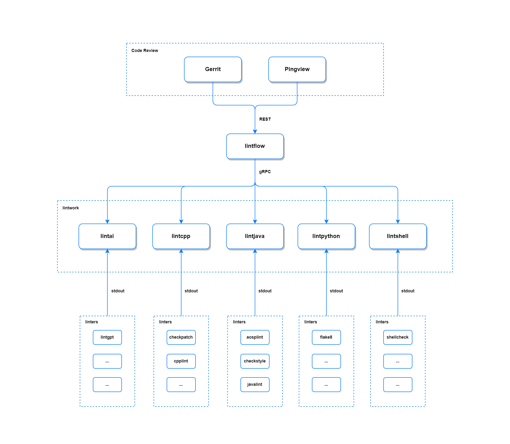

# lintflow

[](https://github.com/devops-lintflow/lintflow/actions?query=workflow%3Aci)
[](https://goreportcard.com/report/github.com/devops-lintflow/lintflow)
[](https://github.com/devops-lintflow/lintflow/blob/main/LICENSE)
[](https://github.com/devops-lintflow/lintflow/tags)


## Introduction

*lintflow* is a server of lint workers written in Go.

- See *[lintwork](https://github.com/devops-lintflow/lintwork/)* as a worker of *lintflow*.


## Prerequisites

- Go >= 1.22.0


## Run

```bash
make build
./bin/lintflow --config-file="config.yml" --code-review="gerrit" --commit-hash="{hash}"
```


## Docker

```bash
docker build --no-cache -f Dockerfile -t devops-lintflow/lintflow:latest .
docker run devops-lintflow/lintflow:latest /lintflow --config-file="/config.yml" --code-review="gerrit" --commit-hash="{hash}"
```


## Compose

```bash
# Run workers
docker-compose -f docker-compose.yml pull
docker-compose -f docker-compose.yml up -d

# Stop workers
docker-compose -f docker-compose.yml stop
docker-compose -f docker-compose.yml rm -f
```


## Usage

```
usage: lintflow --code-review=CODE-REVIEW --commit-hash=COMMIT-HASH --config-file=CONFIG-FILE [<flags>]

Lint Flow

Flags:
  --help                     Show context-sensitive help (also try --help-long
                             and --help-man).
  --version                  Show application version.
  --code-review=CODE-REVIEW  Code review (bitbucket|gerrit|gitee|github|gitlab)
  --commit-hash=COMMIT-HASH  Commit hash (SHA-1)
  --config-file=CONFIG-FILE  Config file (.yml)
```


## Settings

*lintflow* parameters can be set in the directory [config](https://github.com/devops-lintflow/lintflow/blob/main/config).

An example of configuration in [config.yml](https://github.com/devops-lintflow/lintflow/blob/main/config/config.yml):

```yaml
apiVersion: v1
kind: server
metadata:
  name: lintflow
spec:
  flow:
    timeout: 120s
  lint:
    - name: lintai
      host: 127.0.0.1
      port: 9090
      filter:
        include:
          extension:
            - .c
            - .cc
            - .cpp
            - .h
            - .hpp
            - .java
          file:
            - name
          repo:
            - name
      vote: AI-Verified
    - name: lintcpp
      host: 127.0.0.1
      port: 9091
      filter:
        include:
          extension:
            - .c
            - .cc
            - .cpp
            - .h
            - .hpp
          file:
            - name
          repo:
            - name
      vote: Lint-Verified
    - name: lintjava
      host: 127.0.0.1
      port: 9092
      filter:
        include:
          extension:
            - .java
            - .xml
          file:
            - name
          repo:
            - name
      vote: Lint-Verified
    - name: lintpython
      host: 127.0.0.1
      port: 9093
      filter:
        include:
          extension:
            - .py
          file:
            - name
          repo:
            - name
      vote: Lint-Verified
    - name: lintshell
      host: 127.0.0.1
      port: 9094
      filter:
        include:
          extension:
            - .sh
          file:
            - name
          repo:
            - name
      vote: Lint-Verified
  review:
    name: gerrit
    host: http://127.0.0.1/
    port: 8080
    user: user
    pass: pass
    vote:
      - label: AI-Verified
        approval: +1
        disapproval: -1
        message: Voting AI-Verified by lintflow
      - label: Lint-Verified
        approval: +1
        disapproval: -1
        message: Voting Lint-Verified by lintflow
```


## Design




## Errorformat

- **JSON format**

```json
{
  "lint": [
    {
      "file": "name",
      "line": 1,
      "type": "Error",
      "details": "text"
    }
  ]
}
```

- **Text format**

```text
{lint}:{file}:{line}:{type}:{details}
```


## Issues

- Fix comments issue with [change.maxComments](https://gerrit-documentation.storage.googleapis.com/Documentation/3.3.3/config-gerrit.html#change.maxComments).

```
One or more comments were rejected in validation: Exceeding maximum number of comments: 5001 (existing) + 1 (new) > 5000
```


## License

Project License can be found [here](LICENSE).


## Reference

### Gerrit

- [get-change-detail](https://gerrit-review.googlesource.com/Documentation/rest-api-changes.html#get-change-detail)
- [get-content](https://gerrit-review.googlesource.com/Documentation/rest-api-changes.html#get-content)
- [get-patch](https://gerrit-review.googlesource.com/Documentation/rest-api-changes.html#get-patch)
- [query-changes](https://gerrit-review.googlesource.com/Documentation/rest-api-changes.html#query-changes)
- [set-review](https://gerrit-review.googlesource.com/Documentation/rest-api-changes.html#set-review)


### Misc

- [gRPC](https://grpc.io/docs/languages/go/)
- [protocol-buffers](https://developers.google.com/protocol-buffers/docs/proto3)
- [reviewdog](https://github.com/reviewdog/reviewdog)
